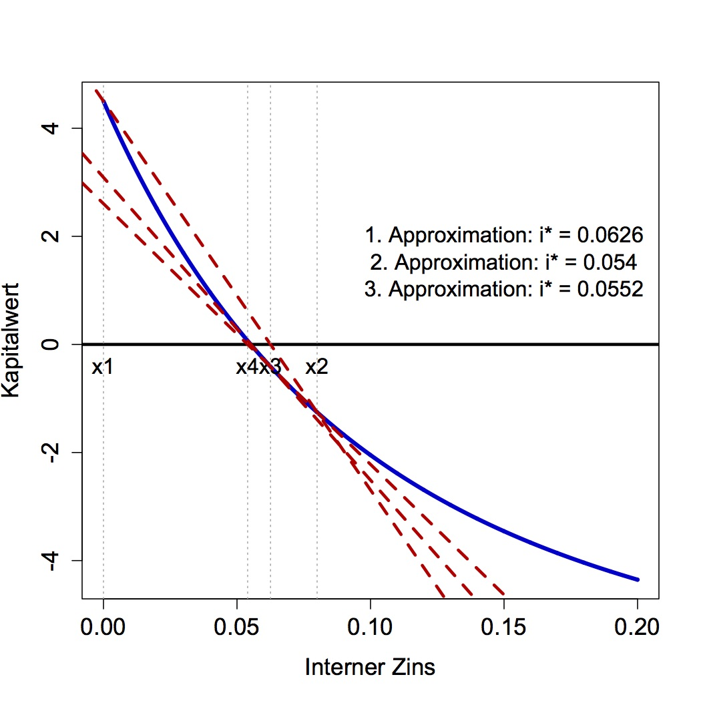

[](http://quantlet.de/index.php?p=info)

## [](http://quantlet.de/) **InternerZins** [](http://quantlet.de/d3/ia)


```yaml
Name of Quantlet: InternerZins 

Description: 'Approximiert den internen Zins in Aufgabe 7.' 

Author:   Awdesch Melzer 

Example: 'Interner Zins' 

```


```R
rm(list=ls(all=T))
graphics.off()


epsilon = 0.05               # Größe des erlaubten Fehlers 
                             # (entscheidet über Anzahl der Iterationen)
i       = seq(0,20,0.01)/100 # Sequenz des Zinses
RBF     = 1/i*(1-1/(1+i)^15) # Rentenbarwertfaktor
C.0     = -8 + RBF - 2/(1+i)^5 - 2/(1+i)^10 + 1.5/(1+i)^15 # Kapitalwert
C.0[1]  = -8 + 4*1-1+4*1-1+4*1+2.5 # Kapitalwert für i = 0

plot(i, C.0, type="l", xlab="Interner Zins",
ylab="Kapitalwert", lwd=4, cex.axis=1.4, cex.lab=1.4, col="blue3")
abline(h=0, lwd=3)

x1 = 0                        # Anfangswert i=0
y1 = C.0[which(i==x1)]
x2 = 0.08                     # Anfangswert i=0.08
y2 = C.0[which(i==x2)]
text(x1,-0.4,"x1",lwd=2,cex=1.3)
abline(v=x1,lty=3,col="darkgrey",lwd=1)
text(x2,-0.4,"x2",lwd=2,cex=1.3)
abline(v=x2,lty=3,col="darkgrey",lwd=1)

a = C.0[1]                    # Schnittpunkt mit y-Achse
b = (C.0[which(i==0.08)]-a)/i[which(i==0.08)] # Steigung
abline(a=a, b=b,col="red3",lwd=3,lty=2)

x3 = x1 - y1*((x2-x1)/(y2-y1)) # 1. Approximation
text(0.15,2,paste("1. Approximation: i* =",round(x3,4)),lwd=2,cex=1.3)
x3
y3 = C.0[which(i==round(x3,4))] # Kapitalwert an der 1. Approximation
text(x3,-0.4,"x3",lwd=2,cex=1.3)
abline(v=x3,lty=3,col="darkgrey",lwd=1)

a = (y3*x2 -y2*x3)/(x2-x3)    # neuer Schnittpunkt mit y-Achse
b = (y2 - a)/x2               # neue Steigung
abline(a=a, b=b,col="red3",lwd=3,lty=2)

x4 = x3 - y3*((x2-x3)/(y2-y3)) # 2. Approximation
text(0.15,1.5,paste("2. Approximation: i* =",round(x4,digits=4)),lwd=2,cex=1.3)
y4 = C.0[which(as.character(i)==as.character(round(x4,digits=4)))]

text(x4,-0.4,"x4",lwd=2,cex=1.3)
abline(v=x4,lty=3,col="darkgrey",lwd=1)

if(abs(y4)>epsilon){ # Teste, ob weitere Approximation notwendig
a = (y4*x3 -y3*x4)/(x3-x4)
b = (y3 - a)/x3#(C.0[which(i==i.star)]-a)/i[which(i==i.star)]
abline(a=a, b=b,col="red3",lwd=3,lty=2)
x5 <- x4 - y4*((x3-x4)/(y3-y4))
text(0.15,1,paste("3. Approximation: i* =",round(multiroot(function(x){a+b*x},start=0.08)$root,digits=4)),lwd=2,cex=1.3)
}
```
